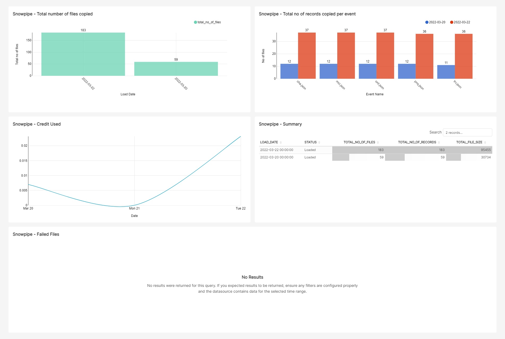

- [Overview](#overview)
- [Installation Instructions](#installation-instructions)
- [Models](#models)
  - [Snowpipe](#snowpipe)
    - [snowpipe__copy_history](#snowpipe__copy_history)
    - [snowpipe__usage_history](#snowpipe__usage_history)
      - [Arguments](#arguments)
      - [Usage](#usage)
  - [Snowflake](#snowflake)
    - [snowflake__query_history](#snowflake__query_history)
      - [Arguments](#arguments-1)
      - [Usage](#usage-1)
- [Macros](#macros)
    - [dbt_snow_utils.clone_schemas](#dbt_snow_utilsclone_schemas)
      - [Arguments](#arguments-2)
      - [Usage](#usage-2)
        - [run-operation](#run-operation)
        - [pre_hook/post_hook](#pre_hookpost_hook)
    - [dbt_snow_utils.clone_table](#dbt_snow_utilsclone_table)
      - [Arguments](#arguments-3)
      - [Usage](#usage-3)
        - [run-operation](#run-operation-1)
        - [pre_hook/post_hook](#pre_hookpost_hook-1)
    - [dbt_snow_utils.clone_tables](#dbt_snow_utilsclone_tables)
      - [Arguments](#arguments-4)
      - [Usage](#usage-4)
        - [run-operation](#run-operation-2)
        - [pre_hook/post_hook](#pre_hookpost_hook-2)
    - [dbt_snow_utils.delete_records_by_column](#dbt_snow_utilsdelete_records_by_column)
      - [Arguments](#arguments-5)
      - [Usage](#usage-5)
        - [run-operation](#run-operation-3)
        - [pre_hook/post_hook](#pre_hookpost_hook-3)
- [Contributions](#contributions)

# Overview
This dbt package contains Snowflake macros and models that can be (re)used across dbt projects with snowflake as target database. 

# Installation Instructions

- Add the package into your project

  **Example** : packages.yml

  ```bash
     - git: "https://github.com/entechlog/dbt-snow-utils.git"
       revision: 0.1.0
  ```

  ```bash
     - package: entechlog/dbt_snow_utils
       version: 0.1.0
  ```

> ✅ Packages can be added to your project using either of above options  
> ✅ Please refer to the release version of this repo/dbt hub for the latest version. The version number mentioned above may not be the updated version number.

- Install the package by running below command
  
  ```bash
  dbt deps
  ```

- Add the following model configuration under the models section of dbt_project.yml. This allows to customize the target database and schema, edit them as needed

  ```yaml
  models:
    dbt_snow_utils:
      staging:
        database: "DEMO_DB"
        schema: staging
      marts:
        database: "DEMO_DB"
        schema: marts
  ```

# Models

## Snowpipe
### [snowpipe__copy_history](/models/staging/snowpipe/stg_snowpipe__copy_history.sql)
### [snowpipe__usage_history](/models/staging/snowpipe/stg_snowpipe__usage_history.sql)
- Snowpipe is Snowflake's continuous data ingestion service. Currently there is not a consolidated dashboard in snowflake which shows the summary of Snowpipe. 
  
- Copy history in [Snowsight](https://docs.snowflake.com/en/user-guide/ui-snowsight-gs.html#) gives a dashboard for table level copy history 
  
- Table functions `INFORMATION_SCHEMA.PIPE_USAGE_HISTORY` and `INFORMATION_SCHEMA.COPY_HISTORY` has copy history but its kept retained for 14 days. The table function avoids the 10,000 row limitation of the LOAD_HISTORY View but is also a slow operation. So adjust SQL predicates to filter the data based on your volume

- This process materialize data from `PIPE_USAGE_HISTORY` and `COPY_HISTORY` into a snowflake table. The target tables can be used to visualize the Snowpipe copy history and usage history with the help of dbt macro `get_snowpipe_details` and dbt models with tag `+tag:snowpipe`

- Add the following variables under vars section of `dbt_project.yml`. This allows to customize the data retrieval filters

  ```yaml
  vars:
    dbt_snow_utils:
      pipe_databases: "ALL"
      filter_by_date: 
      pipe_copy_history_filter_key: "hours"
      pipe_copy_history_filter_value: -36
      pipe_usage_history_filter_key: "day"
      pipe_usage_history_filter_value: -2
  ```

#### Arguments
* `pipe_databases` (optional): The database name with Snowpipes. Valid values are string “ALL” OR list of databases
* `filter_by_date` (optional): The date for filtering data for incremental loads. Should be specified in `YYYY-MM-DD` format, if none specified process will use current date
* `pipe_copy_history_filter_key` (optional): The filter key for table function COPY_HISTORY. Some valid values are `day`, `hour`, `minute`, `second` etc. See [here](https://docs.snowflake.com/en/sql-reference/functions-date-time.html#label-supported-date-time-parts) for list of date and time parts
* `pipe_copy_history_filter_value` (optional): The filter value for table function COPY_HISTORY. Should be negative value and relate to the valid values key can accept
* `pipe_usage_history_filter_key` (optional): The filter key for table function USAGE_HISTORY. Some valid values are `day`, `hour`, `minute`, `second` etc. See [here](https://docs.snowflake.com/en/sql-reference/functions-date-time.html#label-supported-date-time-parts) for list of date and time parts
* `pipe_usage_history_filter_value` (optional): The filter value for table function USAGE_HISTORY. Should be negative value and relate to the valid values key can accept

#### Usage

- Run the models using command
  
  ```bash
  dbt run --select +tag:snowpipe --vars '{"filter_by_date": "2022-03-22"}'
  OR
  dbt run --select +tag:snowpipe --full-refresh
  ```

- This should create `snowpipe__usage_history` and `snowpipe__copy_history` which can be integrated with BI tools to build Snowpipe monitoring dashboards.

  

## Snowflake
### [snowflake__query_history](/models/marts/snowflake/mart_snowflake__query_history.sql)
- This process materialize data from `QUERY_HISTORY ` into a snowflake table. 

- The role used by dbt should have monitor access so it can fetch query executed by all users.
  
  ```sql
  GRANT MONITOR ON WAREHOUSE <ALL-SNOWFLAKE-WAREHOUSE> to role <DBT-ROLE>;
  ```

- Add the following variables under vars section of `dbt_project.yml`. This allows to customize the data retrieval filters

  ```yaml
  vars:
    dbt_snow_utils:
      filter_by_date: 
      query_history_filter_key: "hours"
      query_history_filter_value: -144
      query_history_result_limit: 10000
  ```


#### Arguments
* `filter_by_date` (optional): The date for filtering data for incremental loads. Should be specified in `YYYY-MM-DD` format, if none specified process will use current date
* `query_history_filter_key` (optional): The filter key for table function QUERY_HISTORY. Some valid values are `day`, `hour`, `minute`, `second` etc. See [here](https://docs.snowflake.com/en/sql-reference/functions-date-time.html#label-supported-date-time-parts) for list of date and time parts
* `query_history_filter_value` (optional): The filter value for table function QUERY_HISTORY. Should be negative value and relate to the valid values key can accept

#### Usage

- Run the models using command
  
  ```bash
  dbt run --select +tag:snowflake --vars '{"filter_by_date": "2022-03-30"}'
  OR
  dbt run --select +tag:snowflake --full-refresh
  ```

- This should create `snowflake__query_history` which can be integrated with BI tools to build Snowflake monitoring dashboards.

# Macros
### [dbt_snow_utils.clone_schemas](/macros/clone/clone_schemas.sql)
This macro clones the source schema/schemas into the destination database.

#### Arguments
* `source_schema` (required): The source schema name
* `destination_postfix` (required): The destination schema name postfix
* `source_database` (optional): The source database name
* `destination_database` (optional): The destination database name

#### Usage

##### run-operation
```
dbt run-operation dbt_snow_utils.clone_schemas --args "{'source_database': 'demo_db', 'source_schemas': ['dim', 'fact', 'utils'], 'destination_database': 'demo_db', 'destination_postfix': '_20220323_01'}"
```

##### pre_hook/post_hook
```
pre_hook="{{ dbt_snow_utils.clone_schemas(['dim', 'fact', 'utils'], '_backup', 'demo_db', this.database) }}"
```

### [dbt_snow_utils.clone_table](/macros/clone/clone_table.sql)
This macro clones the source table into the destination database/schema.

#### Arguments
* `source_table` (required): The source table name
* `destination_table` (required): The destination table name
* `source_database` (optional): The source database name
* `source_schema` (optional): The source schema name
* `destination_database` (optional): The destination database name
* `destination_schema` (optional): The destination schema name
  
#### Usage

##### run-operation
```
dbt run-operation clone_table --args '{"source_table": "COUNTRY_CODE", "destination_table": "COUNTRY_CODE_BKP"}'
```

##### pre_hook/post_hook
```
post_hook="{{ dbt_snow_utils.clone_table(this.identifier,this.identifier~'_temp', this.database, this.schema, this.database, this.schema ) }}"
```

### [dbt_snow_utils.clone_tables](/macros/clone/clone_tables.sql)
This macro clones all the tables from source database/schema into the destination database/schema. This also provides an option to truncate the tables after cloning if you just need the table structure and not data.

#### Arguments
* `source_schemas` (required): The list of source schema names
* `source_database` (optional): The source database name
* `destination_database` (optional): The destination database name
* `truncate_table_flag` (optional): Flag to truncate data after copy, When enabled only table structure is copied and not data
  
#### Usage

##### run-operation
```
dbt run-operation clone_tables --args "{'source_database': 'DEV_ENTECHLOG_DW_DB', 'source_schemas': ['dim', 'fact', 'utils'], 'destination_database': 'DEV_ENTECHLOG_DEMO_DB', 'truncate_table_flag': 'True'}"
```

##### pre_hook/post_hook
```
pre_hook="{{ dbt_snow_utils.clone_tables(['dim', 'fact', 'utils'], 'DEV_ENTECHLOG_DW_DB', 'DEV_ENTECHLOG_DEMO_DB', 'True') }}"
```

### [dbt_snow_utils.delete_records_by_column](/macros/common/delete_records_by_column.sql)
This macro deletes data from a table based on a where clause. Often used as pre-hook in incremental loads to delete the data.

#### Arguments
* `del_key` (required): The column name in WHERE clause of deletes
* `del_value` (required): The value for column name in WHERE clause of deletes
* `database` (optional): The database name
* `schema` (optional): The schema name
* `table` (optional): The table name
  
#### Usage

##### run-operation
```
dbt run-operation delete_records_by_column --args '{"del_key": "payment_date", "del_value": "2005-05-25", "database": "DBT_DEMO", "schema": "MARTS", "table": "tmp_store_revenue"}'
```

##### pre_hook/post_hook
```
post_hook="{{ dbt_snow_utils.delete_records_by_column('payment_date', '2005-05-24') }}"

post_hook="{{ dbt_snow_utils.delete_records_by_column('payment_date', var('start_date')) }}"
```
# Contributions
Contributions to this package are welcomed. Please create issues for bugs or feature requests for enhancement ideas or PRs for any enhancement contributions.